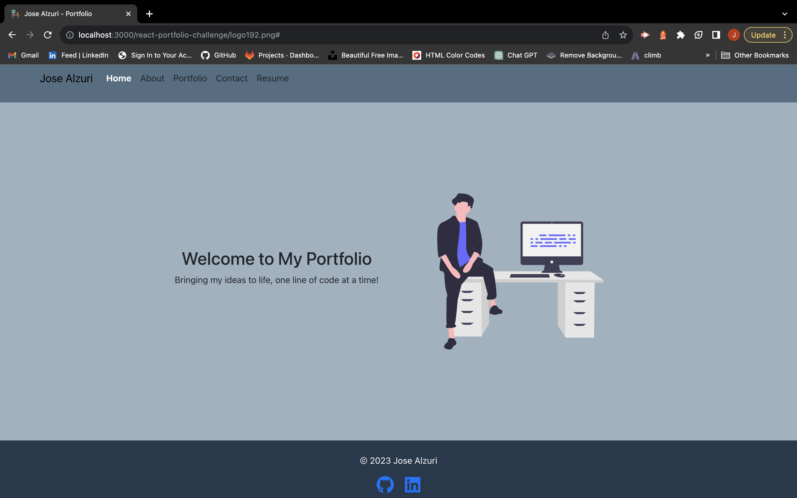
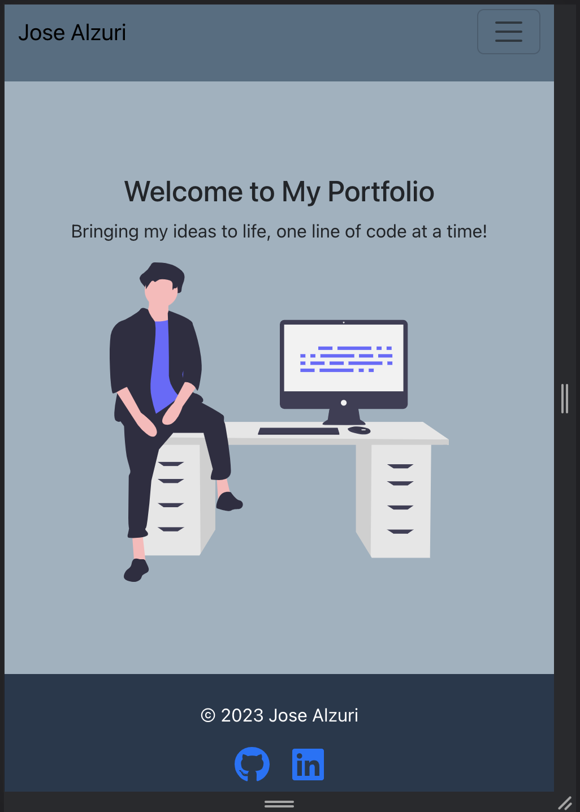

# Jose Alzuri Portfolio

## Description

This is a React-based portfolio website aimed at showcasing my developed projects. It provides an efficient and user-friendly way for potential employers to assess my skills and experience. The motivation behind building this project is to create a modern and responsive portfolio that utilizes the latest technologies, including React.

## Table of Contents

- [Installation](#installation)
- [Usage](#usage)
- [Credits](#credits)
- [License](#license)

## Installation

To run My Portfolio locally, follow these steps:

1. Clone the repository to your local machine: `git clone https://github.com/Jalzu1007/josealzuri-react-portfolio.git`
2. Navigate to the project directory using the terminal.
3. Run `npm install` to install the required dependencies.
4. Start the development server: `npm start` 
6. Open your web browser and navigate to the provided local URL.

## Usage

This portfolio website provides information about my work, skills, and contact details. It includes the following sections:

- About Me: This section displays a recent photo or avatar of myself and a brief bio.

- Portfolio: In this section, you can find titled images of my applications with links to both the deployed applications and their corresponding GitHub repositories.

- Contact: The contact section contains a form with fields for a name, an email address, and a message. It provides instant feedback for required fields and invalid email addresses.

- Resume: This section provides a link to download my resume and a list of my proficiencies.

- Footer: The footer includes text or icon links to my GitHub and LinkedIn profile
    
To experience the portfolio, visit the deployed website: [Jose Alzuri Portfolio](https://jalzu1007.github.io/josealzuri-react-portfolio/)

Screenshots of Portfolio:

 

## Credits

Third-Party Assets:

- https://create-react-app.dev/docs/getting-started
- https://reactjs.org/docs/rendering-elements.html
- https://reactjs.org/docs/components-and-props.html
- https://reactjs.org/docs/state-and-lifecycle.html
- https://reactjs.org/docs/forms.html
- https://reactjs.org/docs/hooks-intro.html
- https://reactjs.org/docs/faq-styling.html
- https://reactjs.org/docs/conditional-rendering.html
- https://reactjs.org/docs/handling-events.html

## License

N/A